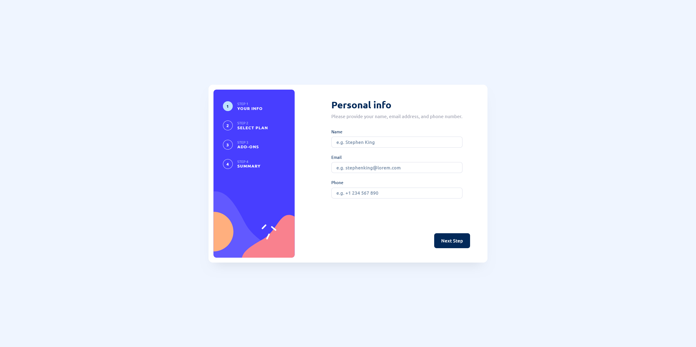

# Frontend Mentor - Multi-step form solution

This is a solution to the [Multi-step form challenge on Frontend Mentor](https://www.frontendmentor.io/challenges/multistep-form-YVAnSdqQBJ). Frontend Mentor challenges help you improve your coding skills by building realistic projects.

## Table of contents

- [Overview](#overview)
  - [The challenge](#the-challenge)
  - [Screenshot](#screenshot)
  - [Links](#links)
- [My process](#my-process)
  - [Built with](#built-with)
  - [AI Collaboration](#ai-collaboration)
- [Author](#author)

## Overview

### The challenge

Users should be able to:

- Complete each step of the sequence
- Go back to a previous step to update their selections
- See a summary of their selections on the final step and confirm their order
- View the optimal layout for the interface depending on their device's screen size
- See hover and focus states for all interactive elements on the page
- Receive form validation messages if:
  - A field has been missed
  - The email address is not formatted correctly
  - A step is submitted, but no selection has been made

### Screenshot

### Links

- Solution URL: [GitHub](https://github.com/GFJankavs/fm-multi-step-form)
- Live Site URL: [Demo](https://kw3j30yxwweliqf6wh6rpf7p.gfjankavs.lv/)

## My process

### Built with

- Semantic HTML5 markup
- CSS custom properties
- Flexbox
- CSS Grid
- Mobile-first workflow
- [VueJS](https://vuejs.org/) - JS Framework
- [Tailwind CSS](https://tailwindcss.com/) - CSS Framework

### AI Collaboration

Describe how you used AI tools (if any) during this project. This helps demonstrate your ability to work effectively with AI assistants.

- What tools did you use (e.g., ChatGPT, Claude, GitHub Copilot)?
  - Claude Code and GitHub Copilot
- How did you use them (e.g., debugging, generating boilerplate, brainstorming solutions)?
  - Bug fixing, DRY principle implementation

## Author

- Website - [GFJ](https://www.gfjankavs.lv)
- Frontend Mentor - [@GFJankavs](https://www.frontendmentor.io/profile/GFJankavs)
- Twitter - [@GFJankavs](https://www.twitter.com/GFJankavs)
